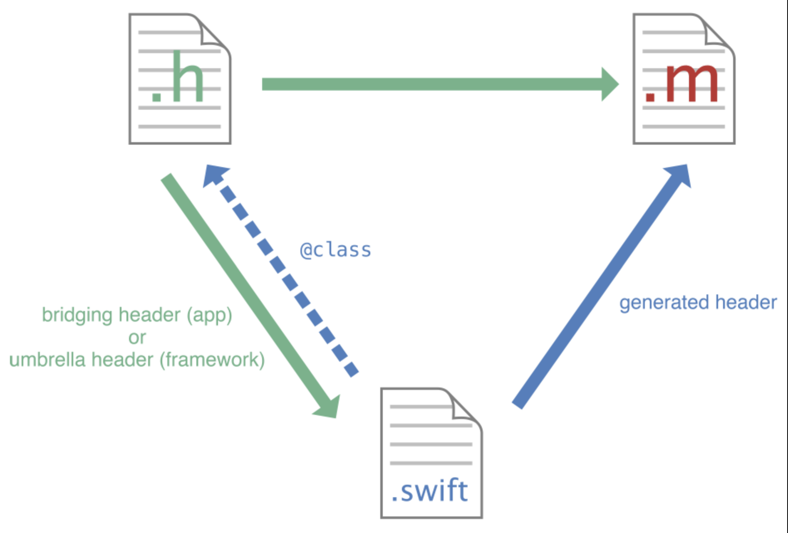
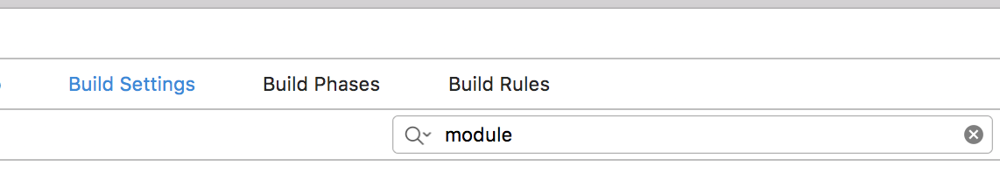
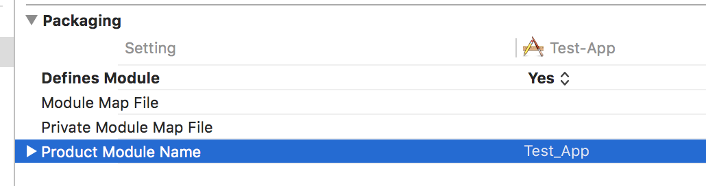

# SSRMixedProduct
OC和Swift混编Demo,
编译环境:
  - Xcode [10.2.1]
  - Swift [5.0]
  - Objecive-C [2.0]

Objective-C和Swift文件可以在一个项目中共存，这使的我们不管是在OC项目中还是Swift项目中，使用另外一种语言都变得简单可行。



### 配置

1. 在混编时，如果创建另一个类型的文件（比如在Swift项目中创建OC文件），会自动生成 "YourProjectName-Bridging-Header.h"文件


2. 在Target -> Build Setting中搜索module

   

3. 设置Defines Module No to YES

   

**关于Module**，可以参考这篇文章[iOS静态库和动态库](https://juejin.im/post/5ce3ef94f265da1bce3da5b5)。

### OC中使用Swift文件

OC中使用Swift文件，必须 import 'YourProjectName-Swift.h', 然后正常使用即可.

```objective-c
#import "SSRMixedProduct-Swift.h"
```


#### 1. 自有类

- Swift中的Class，func，var使用`@objc`标识，表示可以在OC中引用, 比如:

```swift
@objc class Hello: NSObject {
    @objc var helloString : String{
        get{
            return "hello, "
        }
    }
    @objc public func sayHello(_ name: String){
        print(helloString + name)
    }
}
```

- Category分类

  部分Class的分类，在自动补全上还不够完善（吐槽一下🍎），手动复制过去即可。部分分类的方法会被rename, 使用时会自动补全，并使用rename后的方法

### Swift中使用OC文件

在`YourProjectName-Bridging-Header.h`中添加需要引入的OC类，然后在Swift中直接引用，详见[Bridging-Header](SSRMixedProduct/SSRMixedProduct-Bridging-Header.h), 本例中为 `SSRMixedProduct-Bridging-Header.h`

```swift
  let manager = DateManager()
  manager.managerString("SSRMixedProduct")
```

#### 1、delegate

OC的delegate直接在Swift中使用即可。注意delegate必须声明为nullable，具体见Optional。

delegate的声明, 见[delegate声明](./SSRMixedProduct/ObjcViewController.h)

delegate的实现, 见[delegate实现](./SSRMixedProduct/ObjcViewController.m)

#### 2、Block

[OC和Swift中Blcoks的相互调用](./Docs/Blcoks.md)

## 常见的宏
`NS_SWIFT_UNAVALIABLE` 表示只希望该属性或者该方法只在OC中使用

```swift
- (void)managerOnlyOCDate NS_SWIFT_UNAVAILABLE("This method used only by OC.");
```

## Swift中使用OC的宏
    TODO....
## Q&A？

Q: 更改了Bridging-Header.h文件的路径，提示找不到Header.h文件？

A：Target -> Build Settings -> Swift Complier - General -> Objecive-C Bridging header中显示的path, 根据实际更改即可。

Q: 混编中需要使用的一些常量，应该放在哪里？

A: AppObjcConstant.h\m文件中，既可以保留type，也可以在OC和swift中混用。
